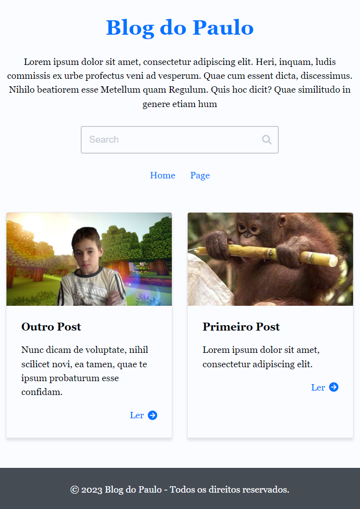

# ❤ Django Blog

Blog fictício construído em Django.

## ⚙ Funcionalidades

- Componentes do blog podem ser ocultados a partir da admin do django.
- Adição e edição de posts dentro da admin do django.
- Pesquisas por conteúdo e filtros por autor, categoria e tags.

## 🛠 Tecnologias

- Python
- Django
- Docker (Desenvolvimento)
